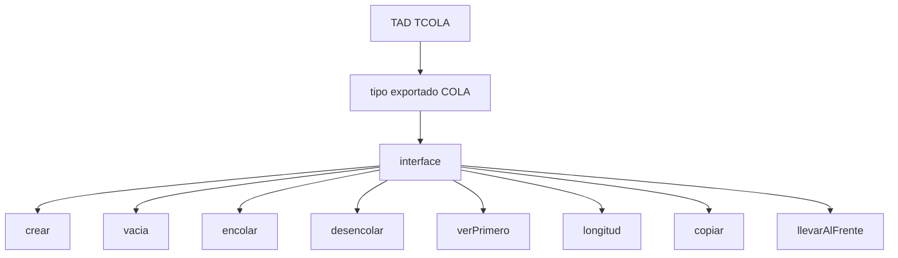
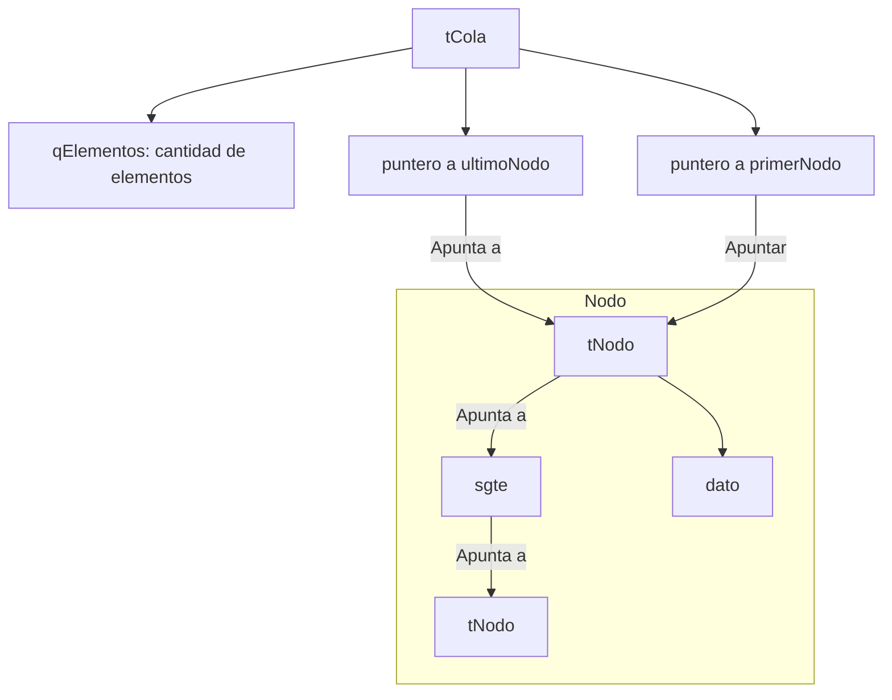
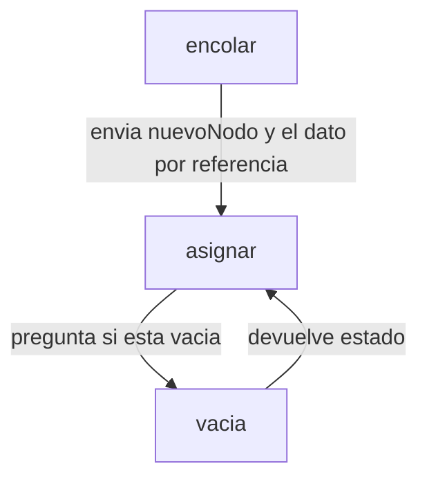
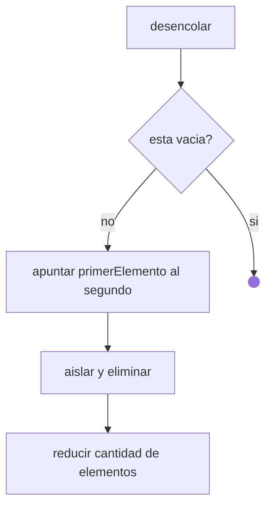

# Actividad Práctica Entregable N° 2  

## Tipo de Datos Abstractos (TAD)
Es una descripción matemática de un objeto no definido nativamente por el lenguaje, que se caracteriza por las operaciones que se pueden realizar sobre él. 
Aunque los problemas básicos pueden resolverse con estructuras simples como variables y arreglos, otros problemas complejos, requieren modelar estructuras que escapan a las predefinidas en el lenguaje. Estas estructuras ofrecen ventajas importantes:
- Ahorro de tiempo en programación, ya que no es necesario desarrollar cada estructura desde cero porque este se importa de otro archivo ya desarrollado.
- Se separa el código en dos capas diferentes
1. Una parte es la especificación que escribe el programador
2. Otra la interfaz que puede utilizar el usuario.
- Estimaciones de tamaño y tiempo de ejecución para sus operaciones.
- Las funciones asociadas a cada estructura son relativamente independientes del lenguaje o la implementación en particular.

## TAD COLA
El TAD Cola es una estructura de datos tipo FIFO (First In, First Out), donde el primer elemento en entrar es el primero en salir, como en un consultorio médico. Frecuentemente, se utiliza como un almacenamiento temporal que conserva el orden de llegada de los elementos hasta que puedan ser procesados. Al igual que la pila, la cola es un subtipo de lista.

## Objetivos
- Implementar el TAD **TCOLA** a partir de una especificación dada, utilizando las estrategias de **RP** y las estructuras de datos trabajadas en el curso.
- Resolver un problema **USANDO** el TAD TCOLA.
- Reflexionar sobre la forma de trabajo que se propone a través del uso de TADs, en comparación a cómo se trabajó hasta este tema.

## Consignas

#### a) ¿Qué estructura de datos propondrían para que el tiempo de ejecución de los algoritmos `longitud`, `encolar` y `desencolar` sea O(1)?

#### b) Se pide que implementes, usando la estructura de datos propuesta en el inciso a), al menos 3 de las funcionalidades provistas por el TAD.


Encolar:

Desencolar:


>Obtenible desde [el repositorio de GitHub](https://github.com/mletelle/ape_tad/blob/main/tcola.c)

#### c) Si la especificación de la interfaz del `TAD TCOLA` no cuenta con la funcionalidad `longitud`, ¿podrían determinar la cantidad de elementos de la cola usando el resto de las funcionalidades? Diseñe la solución propuesta, asumiendo el rol de usuario del TAD.

#### d) **USANDO** el `TAD TCOLA`, diseña e implementa una función llamada `existe` que reciba una cola `C` y un valor entero `X`, y retorne la posición en la que se encuentra el elemento `X`. Ten en cuenta que el valor podría no existir, en cuyo caso la función debe retornar `-1`.

#### e) ¿En qué aspectos la forma de trabajo con TADs `mejora` o `facilita` la resolución de problemas usando algoritmos que trabajamos hasta el momento?


## Bibliografia

- Arriondo, R., Bottazzi, C., Costarelli, S., D’Elía, J., Dalcin, L., Galizzi, D., Giménez, J. M., Olivera, J., Novara, P., Paz, R., Prigioni, J., Pucheta, M., Rojas Fredini, P. S., Romeo, L., Sánchez, I., Storti, M., Tessi, G., & Vidocevich, J. P. (2023). Algoritmos y Estructuras de Datos (Versión AED-2.0.5-1584-gdfa537f7). Facultad de Ingeniería y Ciencias Hídricas, Universidad Nacional del Litoral, Centro de Investigación de Métodos Computacionales (CIMEC, CONICET-UNL). Recuperado de https://cimec.org.ar/~mstorti/aed/aednotes.pdf
- Hernández, R., Lázaro, J. C., Dormido, R., & Ros, S. (2001). Estructuras de Datos y Algoritmos. Prentice Hall.
- Knuth, D. E. (1981). The Art of Computer Programming. Addison-Wesley.
- Aho, A. V., Hopcroft, J. E., & Ullman, J. D. (1988). Estructuras de Datos y Algoritmos. Addison-Wesley Publishing Company.
- Joyanes Aguilar. (2001). Fundamentos de Programación: Algoritmos, estructura de datos y objetos (4.a ed.). McGraw Hill. Capítulos 15-18.
- Sznajdleder, P. A. (2021). Algorítmos a fondo con aplicaciones en C y Java. Capítulo 9.

## Sugerencias:
Para links [stackedit](https://stackedit.io/app#)

Para **negrita**
Para ****negrita****
>Para quote

|                |Tabla|Columna                         |
|----------------|-------------------------------|-----------------------------|
|Texto|`Texto`            |Mas texto            |

Graficos UML
```mermaid
sequenceDiagram
Texto ->> Bob: Texto , how are you?
Bob-->>John: Texto?
Note right of John: Texto<br/>Texto<br/>Texto<br/>Texto.
