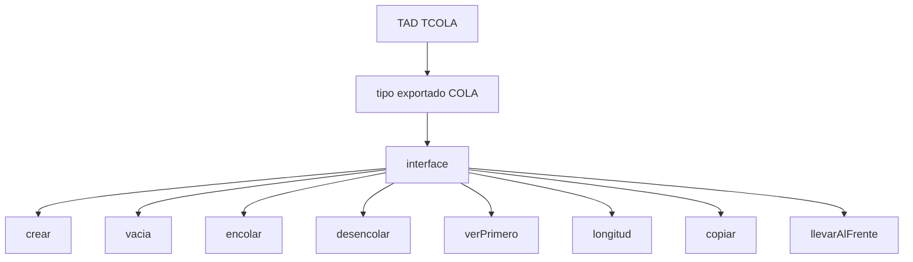
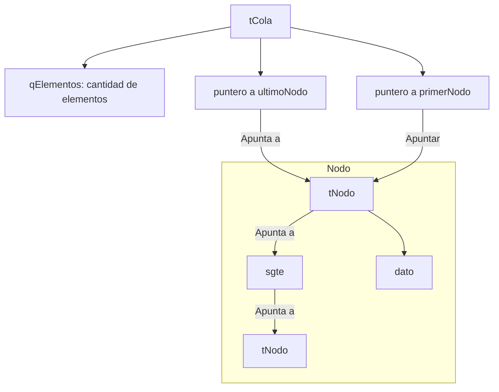
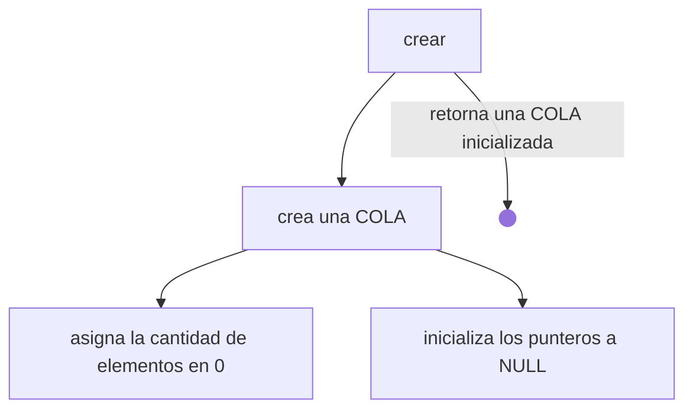
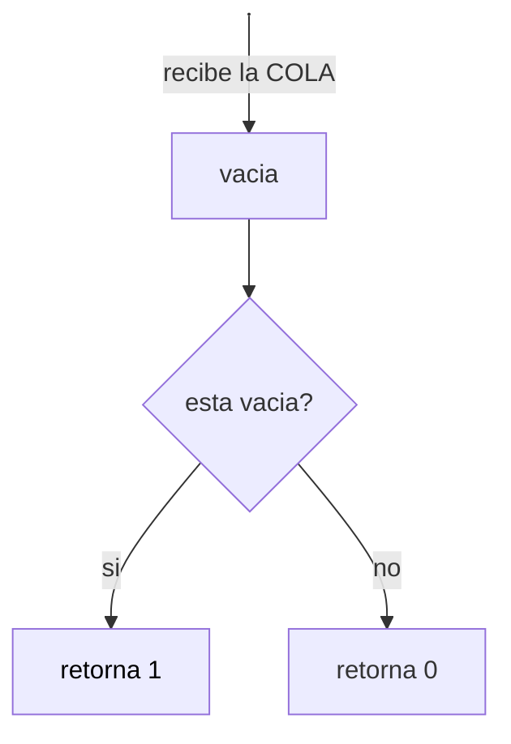
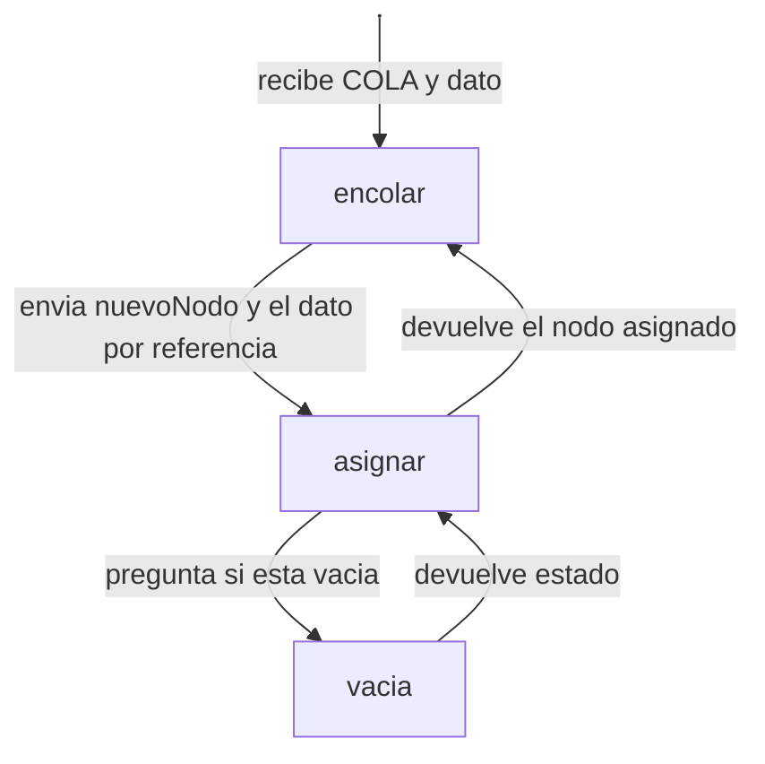
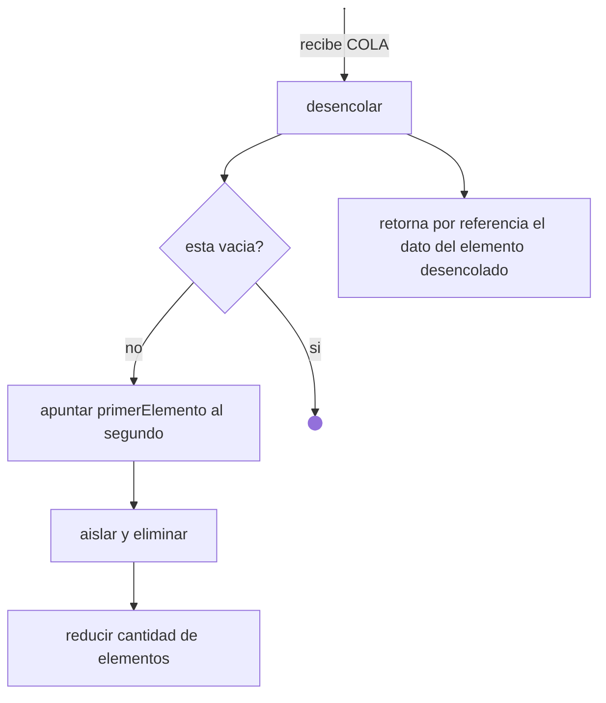
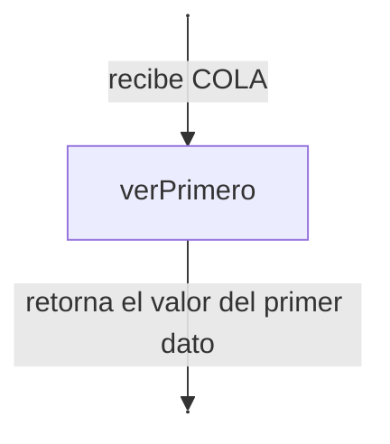
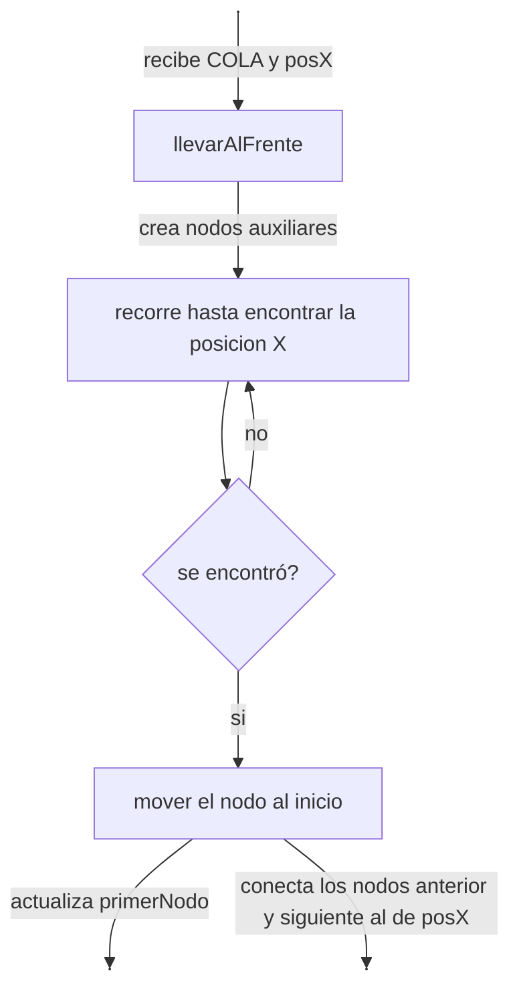
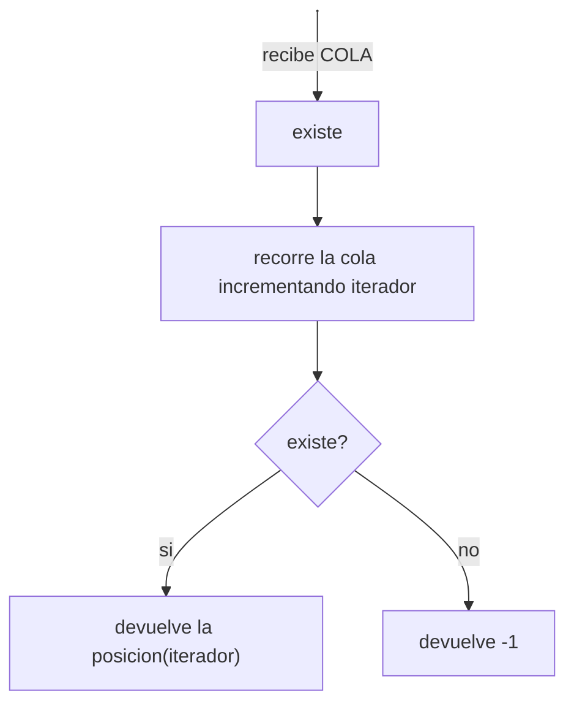

*no borrar hasta miercoles 14* MODIFICAR ENLACES ANTES DE ENTREGAR
# Actividad Práctica Entregable N° 2  

## Tipo de Datos Abstractos (TAD)
Es una descripción matemática de un objeto no definido nativamente por el lenguaje, que se caracteriza por las operaciones que se pueden realizar sobre él. 
Aunque los problemas básicos pueden resolverse con estructuras simples como variables y arreglos, otros problemas complejos, requieren modelar estructuras que escapan a las predefinidas en el lenguaje. Estas estructuras ofrecen ventajas importantes:
- Ahorro de tiempo en programación, ya que no es necesario desarrollar cada estructura desde cero porque este se importa de otro archivo ya desarrollado.
- Se separa el código en dos capas diferentes
    - Una parte es la especificación que escribe el programador
    - Otra la interfaz que puede utilizar el usuario.
- Estimaciones de tamaño y tiempo de ejecución para sus operaciones.
- Las funciones asociadas a cada estructura son relativamente independientes del lenguaje o la implementación en particular.

## TAD COLA
El TAD Cola es una estructura de datos tipo FIFO (First In, First Out), donde el primer elemento en entrar es el primero en salir, como en un consultorio médico. Frecuentemente, se utiliza como un almacenamiento temporal que conserva el orden de llegada de los elementos hasta que puedan ser procesados. Al igual que la pila, la cola es un subtipo de lista.

## Objetivos
- Implementar el TAD **TCOLA** a partir de una especificación dada, utilizando las estrategias de **RP** y las estructuras de datos trabajadas en el curso.
- Resolver un problema **USANDO** el TAD TCOLA.
- Reflexionar sobre la forma de trabajo que se propone a través del uso de TADs, en comparación a cómo se trabajó hasta este tema.

## Consignas

#### a) ¿Qué estructura de datos propondrían para que el tiempo de ejecución de los algoritmos `longitud`, `encolar` y `desencolar` sea O(1)?
> Obtenible desde [el repositorio de GitHub](https://github.com/mletelle/ape_tad/blob/main/tcola.c)
Nuestra propuesta utiliza una estructura de datos eficiente para lograr tiempos de ejecución `O(1)` en estas operaciones, basada en una estructura de tipo `tCola`, que actúa como “locomotora” de la lista enlazada que es la cola; esta estructura contiene punteros a los nodos **primero** y **último**, y con un contador que mantiene el **número de elementos** en la cola.

 - `longitud`: se accede al valor contenido en el contador `qElementos`, tiempo O(1).  
 - `encolar`: inserta un nuevo nodo al final de la lista, actualizando el puntero ultimoNodo, enlazando al nuevo elemento encolado, tiempo O(1).  
 - `desencolar`: elimina el primer nodo, moviendo el puntero primerNodo, y actualizando el primer elemento de la cola, tiempo O(1).

El tipo exportado se define en el header como `typedef struct tCola *COLA;`

Y la estructura de la implementación puede entenderse más fácilmente con el siguiente gráfico:

#### b) Se pide que implementes, usando la estructura de datos propuesta en el inciso a), al menos 3 de las funcionalidades provistas por el TAD.
> Obtenible desde [el repositorio de GitHub](https://github.com/mletelle/ape_tad/blob/main/tcola.c)

Crear:


Vacia:


Encolar:


Desencolar:


Ver primero:


Longitud:
```mermaid
flowchart  TD
A["longitud"]  -->  B["retornar cantidad elementos"]
n1["Untitled Node"]  -- recibe la COLA -->  A
n1@{ shape: anchor}
   ```
Copiar:

```mermaid
flowchart TD
    n2["Untitled Node"] -- recibe COLA --> n1["copiar"]
    n1 -- <span style=background-color:>crear otra cola</span> --> n4["recorre COLA"]
    n4 -- <span style=background-color:>copia elemento a elemento</span> --> n5["asigna la nueva COLA al parametro recibido por referencia"]
    n2@{ shape: anchor}
```
Llevar al frente:


> Obtenible desde [el repositorio de GitHub](https://github.com/mletelle/ape_tad/blob/main/tcola.c)

#### c) Si la especificación de la interfaz del `TAD TCOLA` no cuenta con la funcionalidad `longitud`, ¿podrían determinar la cantidad de elementos de la cola usando el resto de las funcionalidades? Diseñe la solución propuesta, asumiendo el rol de usuario del TAD.

Si la especificación de la estructura del TAD COLA no incluyera la funcionalidad `longitud`, aún podría ser posible determinar la cantidad de elementos de la cola cuando se utilicen las demás operaciones disponibles como `encolar` y `desencolar`. Para lograr esto:

 - iniciamos una variable `contadora de elementos` en el programa principal (que usa el TAD) en 0 elementos
- incrementando la variable contadora con cada `encolar` 
- y disminuyendo con cada `desencolar`. 

De esta forma el contador reflejaría en todo momento, con un tiempo de acceso de `O(1)`, el total de los elementos de la cola, sin emplear la función `longitud` del TAD.
#### d) **USANDO** el `TAD TCOLA`, diseña e implementa una función llamada `existe` que reciba una cola `C` y un valor entero `X`, y retorne la posición en la que se encuentra el elemento `X`. Ten en cuenta que el valor podría no existir, en cuyo caso la función debe retornar `-1`.

> Obtenible desde [el repositorio de GitHub](https://github.com/mletelle/ape_tad/blob/main/main.c)


#### e) ¿En qué aspectos la forma de trabajo con TADs `mejora` o `facilita` la resolución de problemas usando algoritmos que trabajamos hasta el momento?

El trabajo con Tipos Abstractos de Datos (TAD) **mejora** y **facilita** la resolución de problemas complejos, comparado con tipos de datos primitivos del lenguaje que usábamos antes de aprender sobre TAD por lo siguiente:

El uso de TAD es más **flexible** a la hora de plantear y abordar un problema, ya que **abstrae** al usuario de los detalles de implementación o de cómo resolver un problema específico. En lugar de enfocarse en cómo se va a hacer, el TAD se centra en lo que se quiere lograr.

El usuario no tiene que aprender **CÓMO** funciona, sino **QUÉ** hace, ya que los TAD **ocultan** los detalles de implementación y el usuario interactúa sólo mediante una **interfaz**, a través de un conjunto de operaciones definidas, sin necesidad de conocer la estructura interna.

Ya que los problemas reales implican tener que modelar situaciones más complejas que datos nativos del lenguaje, los TAD proporcionan un modelo abstracto que permite manipular los datos de manera más sencilla y eficiente. Ahorrando tiempo al usuario de nuestra `COLA`  ya que de esta manera, sólo deberá `crear` la cola y suministrar un dato para `encolar`, y no debe diseñar la estructura y cada una de las funciones desde 0.
Incluso, si una persona no sabe programar, puede entender la lógica de mi algoritmo que emplea TAD, ya que este utiliza palabras descriptivas (como `vacía` o `encolar`), que reflejan claramente las acciones que realiza el algoritmo.

Otro beneficio de usar un TAD, es que puede ser compartido y reutilizado en diferentes programas sin necesidad de redefinir la estructura o las operaciones internas; esto es útil ya que da la posibilidad de usar un TAD **diseñado por otras personas**, como compañeros de curso o descargadas de Internet como si fueran bibliotecas.


## Bibliografia

- Aho, A. V., Hopcroft, J. E., & Ullman, J. D. (1988). Estructuras de Datos y Algoritmos. Addison-Wesley Publishing Company.
- Arriondo, R., Bottazzi, C., Costarelli, S., D’Elía, J., Dalcin, L., Galizzi, D., Giménez, J. M., Olivera, J., Novara, P., Paz, R., Prigioni, J., Pucheta, M., Rojas Fredini, P. S., Romeo, L., Sánchez, I., Storti, M., Tessi, G., & Vidocevich, J. P. (2023). Algoritmos y Estructuras de Datos (Versión AED-2.0.5-1584-gdfa537f7). Facultad de Ingeniería y Ciencias Hídricas, Universidad Nacional del Litoral, Centro de Investigación de Métodos Computacionales (CIMEC, CONICET-UNL). Recuperado de https://cimec.org.ar/~mstorti/aed/aednotes.pdf
- Dasso, A., & Funes, A. (2014). Tipos de Datos Abstractos. Área de Programación y Metodologías de Desarrollo del Software, Departamento de Informática, Facultad de Ciencias Físico-Matemáticas y Naturales, Universidad Nacional de San Luis, Argentina.
- Hernández, R., Lázaro, J. C., Dormido, R., & Ros, S. (2001). Estructuras de Datos y Algoritmos. Prentice Hall.
- Joyanes Aguilar. (2001). Fundamentos de Programación: Algoritmos, estructura de datos y objetos (4.a ed.). McGraw Hill. Capítulos 15-18.
- Knuth, D. E. (1981). The Art of Computer Programming. Addison-Wesley.
- Sznajdleder, P. A. (2021). Algorítmos a fondo con aplicaciones en C y Java. Capítulo 9.

